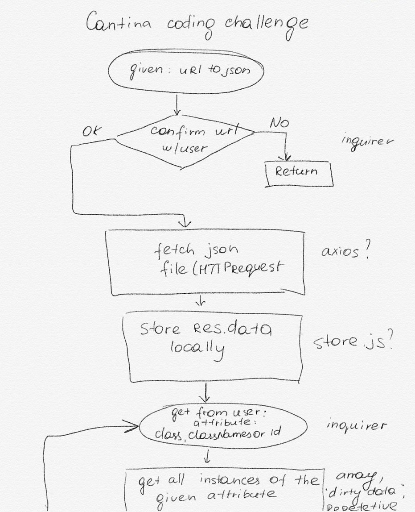
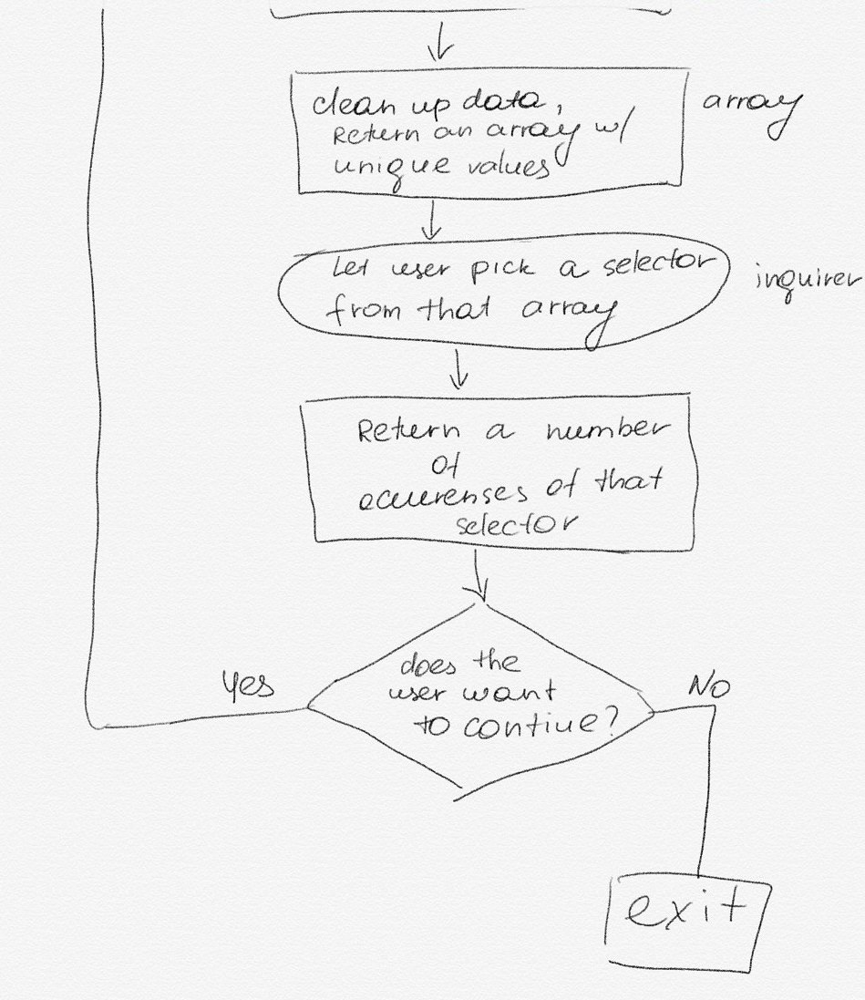

# Cantina coding challenge

# Problem
Write a command line program in a language of your choosing that parses the following JSON file from stdin or from command line argument:
https://github.com/jdolan/quetoo/blob/master/src/cgame/default/ui/settings/SystemViewController.json
Your program may assume that the file resides locally on the same filesystem as the program itself,
or it may retrieve it via web request if you prefer.
The JSON file represents a view hierarchy in a user interface. You can think of it as a tree of nodes, just like elements in an HTML DOM. Like in HTML, views have certain attributes that are selectable, ala CSS selectors.
Once parsed, your program should wait for user input on stdin.
Each line the user enters on stdin should be treated as a selector, and your program should print the matching views, as JSON, to stdout. The exact format of your output is entirely up to you.

The program must support simple selectors for the following view attributes:

class - The view class name, e.g. "StackView"
classNames - CSS class names, e.g. ".container"
identifier - The view identifier, e.g. "#videoMode"

You can effectively ignore all other attributes in the JSON model for the purpose of selector matching. Note that views have several attributes that may nest child views. For this exercise, you only need to consider subviews, contentView, input and control.

Compound selectors (e.g. "View#identifier") are not required, but you’ll certainly impress us if you support them. Selector chains (e.g. "StackView .container")  are not required, but again, you’ll certainly impress us if you support those, too.

There are 26 views in the given JSON file with the class of Input. Ensure the correctness of your program by asserting that it finds all 26 Inputs given the selector "Input".
Please share your solution with us via a public Github repository.

## Table of contents
* [Install and use](#usage)
* [Development process](#development-process)
* [Screenshots](#screenshots)
* [Technologies](#technologies)
* [Contact](#contact)

## Usage

1) Clone the repository

2) Run npm install

3) From the root of the repository in the command line run:

node index.js start

4) Follow the command line interface

## Development process

Here are the steps that I followed in the development process:

1) Read the problem carefully to make sure that I have a clear understanding of what is expected of me

2) Choosing technologies - I picked Node.js and JavaScript mainly because of a wide range of available Node modules that make the development process significantly faster. Plus, JS is the language that I feel the most confident in.

3) I like to start solving problems with brainstorm and whiteboarding. I provided the screenshot of my whiteboard schema.

4) The critical step in any project is writing tests. I wrote tests for the largest and the most important functions to simplify the further development process.

5) After finishing all the separate units, I combined them in the main function with a chain of Promises.

## Whiteboarding

## Technologies
### Solved with:
* JavaScript ES6
* Node.js

### Node Modules:
 #### CLI modules:
 - Commander
 - Inquirer

#### Http request
* Axios

#### Testing
* Chai
* Mocha

#### Other
* eslint
* count-array-values

## Contact
Created by Elina Gorshkova(
* https://github.com/elinagorshkova,
* contact@elinag.dev,
* https://elinag.dev) - feel free to contact me!
